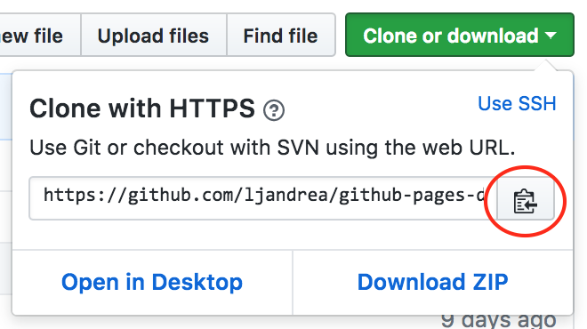
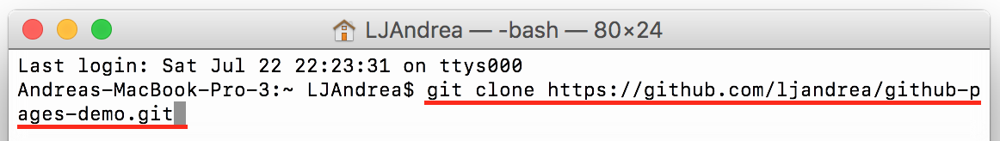

# Update: How to Use GitHub Pages at Home!

#### As requested, this is a little tutorial on how you can work with GitHub and the Command Prompt from home! I've included everything I can think of in terms of what you'll need to do as well as issues you might encounter. If you run into any problems, please don't hesitate to email me with any questions you have!

### If you need to download the Processing IDE to your computer:

[Here's](https://processing.org/download/) the link to the website!

### After you log into GitHub...
1. Open up the **Command Prompt** if you have Windows or **Terminal** if you have a Mac. You can figure out where you are in your computer by checking right here:

  
  

  Alternatively, you can type in ```cd``` for the Command Prompt or ```pwd``` for Terminal, and it should tell you where you are as well.

2. On GitHub, go to your repository and click **Clone or download**. Then, click on the **clipboard symbol** to copy the url shown.

  

3. In the Command Prompt/Terminal, type in the command ```git clone``` followed by the url you copied. This'll put a copy of your GitHub files on your computer.  (ADD PIC FOR COMMAND PROMPT)

  
4. After all the files are on your computer, navigate to where they are located by using the command ```cd [your file path here]```.

  For example, if your files are organized like this:

  

  you can use ```cd``` for every folder, like in this example:

  

  Or, you can type it in all in one line like this, with forward slashes separating each folder:

  


  Pro tip: if you hit **tab** while you're typing in a folder's name, your computer will automatically finish it for you!

From here, you can go ahead and edit whatever files you need to! You don't need to clone your files onto your computer every time; as long as they're on there, and you navigate to them in the Command Prompt/Terminal via the ```cd``` command, you should be good. One piece of advice: **Do not edit your code directly on GitHub.** Not only is this a bad habit, but it also causes a lot of problems when you edit one file on GitHub and another directly on your computer, and then you try to publish your changes on GitHub (I'm sure a lot of you remember all the issues we had with this during camp 😕).


### To push up your changes to GitHub:

These commands should look familiar to you all now. **It's good practice to push up your changes to GitHub periodically.** For example, whenever you make major changes to one file, go ahead and push up those changes. If something goes wrong, it's better to only have a little bit of code messed up as opposed to a lot.

+ ```git status``` - Tells you what files have been changed, added, deleted, etc. in your repository
+ ```git add .``` - Stages your changes; makes them ready to go up on GitHub!
+ ```git commit -m "[describe what you did in the quotes]"``` - Commits all the changes you've **staged** to your repository
+ ```git push``` - Pushes all the commits you've made up to GitHub


### Common Issues ☹️

The biggest issue you'll probably face will look a little something like this, when you try to push up your changes to GitHub:


Basically, if you make changes to the same file in two different places (like on GitHub and locally on your computer), and try to push up one of them, your computer doesn't know which version you want to keep.

**So, here's how you fix it!**

1. Use this command to pull in your GitHub code onto your computer: ```git pull --rebase origin master```

  It should tell you there's a ```CONFLICT``` and gives you some tips as to how to proceed:

  

2. Open up the files that are in conflict (in this case, it was an html file I had), and manually change it so that it looks like how you want it to.

3. Add your changes: ```git add .```

4. Continue the pulling process: ```git rebase --continue```

5. Finally, push up all your changes to GitHub: ```git push```

This is what the Command Prompt/Terminal should look like when everything's all fixed:


#### That's it! You should have everything you need to use Processing and GitHub Pages from home. Again, _do not hesitate to email me_ if you have questions. Good luck!


# How to Use GitHub Pages

### If you don't have a GitHub Account... (or if you already do, skip to step 2)
1. Go to GitHub.com and sign up
2. Click “Create a New Repository”
3. Name it **username.github.io** (aka the username that you signed up with)
4. Search in the “Ask me Anything” bar **Command Prompt**
5. Make sure the Command Prompt is saving to the Z drive. (Z:\>)
6. Go to https://pages.github.com and scroll down to instruction #2 “Clone the repository”.
7. Copy the code there and paste it to the Command Prompt and continue copying the code from there.
8. Check on both GitHub and your computer to make sure you have a file called **index.html**

### Demo
##### Step 1:


##### Step 2:


##### Step 3:


##### Step 4:


##### When you're finished, go to your website: https://username.github.io
It should look something like this:


#### Note: Keep Command Prompt open while you do this tutorial!

## Setting Up Your GitHub Repository

1. At the top right corner of this page, **fork** this repository, and make sure that you're logged into your GitHub account. That way, you'll have a copy of these instructions on your own GitHub account if you ever want to reference them later.

  

2. On your computer, find the folder named **github-pages-demo** in the Z drive.
3. Copy and paste the following files into your **username.github.io** folder in the Z drive: **index.html** and  **processing.min.js**

  Go ahead and replace the original index.html file you had initially.

4. Finally, make a new folder called **sketches**. This is where you'll put all your Processing code.

## Converting Your Khan Academy Code to Processing.js

We're almost there! In order to host your code on GitHub Pages, you're going to have to make a few changes to your Khan Academy code.

1. Go to File Explorer, click "This PC", and search "Processing". Click on the link called **processing - Shortcut**.
2. In a new sketch, add these lines:

  

3. Copy and paste your code from a Khan Academy project into the new sketch.
4. Place any lines of code that draw something (lines, ellipses, etc.) into a ```void draw()``` function. It should look something like this:

  

5. If you have any variables that control an animation (i.e. ```var x = 20```, ```var speed = 5```), declare those at the **beginning** of your code, before ```void setup()``` and be sure to **specify their type** by replacing ```var``` with ```int``` for integers and ```float``` for decimals.
6. Any mouse or keyboard events might have to be changed as well. For example, ```mouseIsPressed``` will change to ```mousePressed```. Here's a link to the [Processing.js reference page](http://processingjs.org/reference/) to check for any other changes you'll have to make to your code. Also, take a look at the ```sketches``` folder in this repository if you need more examples on how it should look.
7. Once you get your code working just the way you want, save the sketch into the **sketches** folder in username.github.io.
8. Repeat these steps with any other projects you want to put on your website.

## Viewing Your Processing.js Projects on the Internet!

All that's left to do is to return to your ```index.html``` file and follow the instructions there to get your sketches so that they'll show up on the Internet. Then, input the following commands into Command Prompt to push all your changes up to your GitHub repository. It should look a little something like this (but instead of test_repo, it should say username.github.io):

+ **git status**

  
+ **git add .**
+ **git commit -m "added and edited files to host Processing on GitHub Pages"**

  

+ **git push**

  

Once you've finished that, you should be able to go to ```username.github.io``` and see all your projects there!
